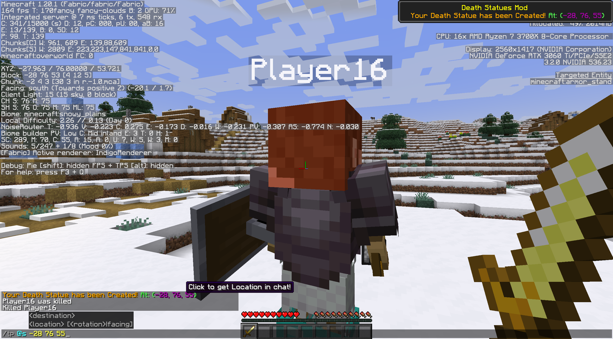

# Death-Statues-Mod-1.20.X
Death Statues Mod

> [!WARNING]
> W.I.P! As of this version (1.2)

This is my first Minecraft mod and it uses fabric. The idea of the mod is just to spawn a statue of a player when they die and have it as a collectible.

At the moment, when the player dies, an armor stand spawns. The armor stand wears whatever the player had on (armor & mainhand/offhand items). It even grabs the player skin for a player head if there is no helmet!

There are three main goals for this project:

- [ ] 1 - Make a "faux-player-model" instead of using an armor stand for the statue
  - [ ] 1.1 - Implement skin caching to avoid hitting api request limit
  - [ ] 1.2 -  Make the player model drop as an item with full NBT data instead of just destroying an invulnerable armor stand (items otherwise drop, A.K.A. duplicate)

- [x] 2 - Make custom toast popups to indicate when/where the player's death statue spawned and when the player destroys it
  - [x] 2.1 - Make custom background
  - [ ] 2.2 - Make custom icon
  - [ ] 2.3 - Make custom sounds
  - [x] 2.4 - Make toast display coordinates of Death Statue
  - [x] 2.5 - Add text wrapping to toast
  - [x] 2.6 - Adjust toast texture with size of description lines

- [ ] 3 - Make statue act as grave and contain all player's dropped items on death. 
  - [ ] 3.1 When the player destroys the statue, make it drop all the items except what you choose to leave on (specific armor/weapons)

P.S. I added a shaped saddle recipe for fun (leather & iron).

## Welcome Toast Message
When you load into a world, you'll get a little welcome toast message.

You can also press [R] on your keyboard for now to replicate it (mainly for testing).

### Death Statue Creation/Spawn Toast Message
When you unalive, the statue will spawn with all the items on, and you'll get toast and chat messages.

Both of these have the coordinates to where it spawned.

The chat also has a clickEvent that will suggest a teleport command in chat for you!

### Death Statue Destruction Toast Message
When you destroy your statue, you'll get toast and chat messages.

