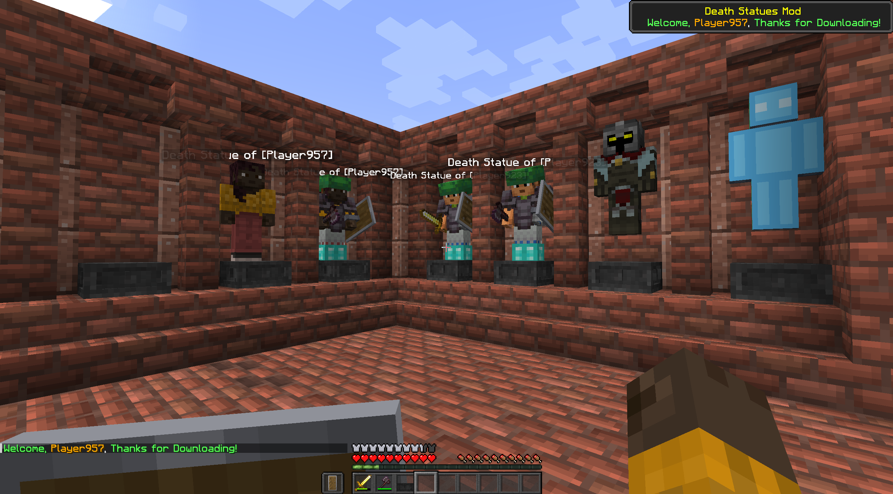

# Death-Statues-Mod-1.20.X
Death Statues Mod -> Now with Config Options Compatible with ModMenu!

> [!WARNING]
> W.I.P! As of this version (1.6.4), there is still not a custom block entity renderer for the statue block!

> [!NOTE]
> New Images Coming Soon

This is my first Minecraft mod and it uses fabric. The idea of the mod is just to spawn a statue of a player when they die and have it as a collectible.

At the moment, when the player dies, a player-like statue spawns.

The statue wears whatever the player had on (armor & mainhand/offhand items). It even grabs the player skin!

You can [R-CLICK] on it to access a statue base block's storage if it is above one.

You can [SHIFT] + [R-CLICK] to swap armor and hand items like on an armor stand!

You can [SHIFT] + [L-CTRL] + [R-CLICK] to pick it up in item form. You can use the item to place it back down, inventory and all!

You can press [R] to spawn a half ring of fake statue entities,
with your name instead of the regular death statue name, that can allow you to make a quick escape or play a goofy prank

\
There are three main goals for this project:
- [x] 1 - Make a "faux-player-model" instead of using an armor stand for the statue
  - [x] 1.1 - Implement skin caching to avoid hitting api request limit
  - [x] 1.2 - Make the statue entity pick-up-able as an item with full NBT data that can be placed
  - [x] 1.3 - Sync textures across server

- [x] 2 - Make custom toast popups to indicate when/where the player's death statue spawned and when the player destroys it
  - [x] 2.1 - Make background
  - [ ] 2.2 - Make custom icon
  - [ ] 2.3 - Make custom sounds
  - [x] 2.4 - Make toast display coordinates of Death Statue
  - [x] 2.5 - Add text wrapping to toast
  - [x] 2.6 - Adjust toast texture with size of description lines

- [x] 3 - Make the statue a BlockEntity instead of a faux-player-entity 
  - [x] 3.1 When the player destroys the statue, make it drop all the items except what you choose to leave on (specific armor/weapons)
  - [x] 3.2 Make statue have storage capacity
  - [ ] 3.3 Make statue block entity have poses, inventory, armor & item renderers

P.S. I have added shaped recipes for the Death Statue Block, Base block, and a saddle recipe for fun (leather & iron).

## Welcome Toast Message
When you load into a world, you'll get a little welcome toast message.

### Death Statue Creation/Spawn Toast Message
When you unalive, the statue will spawn with all the items on, and you'll get toast and chat messages.

>-> You can also press [R] on your keyboard for now to replicate this (mainly for testing) <-

Both of these messages have the coordinates to where it spawned.

>-> The chat also has a clickEvent that will suggest a teleport command in chat for you! <-

### Now Works on Servers!
You can share in the morbid fun of having death statues (blocks & entities) on servers

### You Can Open the Base Block's Storage by Right-Clicking on the Death Statue Entity or the Block

When you right-click to open the container from the Death Statue Block, it updates/changes the Statue Block's texture

### Death Statue Destruction Toast Message
When you destroy your statue, you'll get toast and chat messages.

### You Can't Destroy Other's Statues, Unless You're In Creative Mode
You can only destroy the statue that has your name as part of its name, unless you're in creative

### Added Toast Message When You Whisper to a Player
When you use /msg to whisper to another player, they will receive a toast popup of the message

